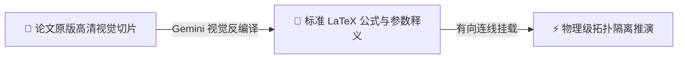

# ⚡ AxiomFlow

> **AxiomFlow: A DAG-based Scientific Reasoning & Anti-Hallucination Literature Inquiry Engine with Multimodal Mathpix-grade Formula Extraction.**  
> 基于有向无环图（DAG）拓扑隔离、客观文献实证锚定与多模态公式反编译的下一代科学研究推演引擎。

[](https://opensource.org/licenses/MIT)
[](https://www.python.org/)
[](https://ai.google.dev/)
[](https://katex.org/)

---

## 📖 核心痛点与设计哲学 (The Core Philosophy)

### 为什么传统的“线性对话 (ChatPDF)”无法胜任严密的科研工作？
1. **记忆衰减与迷失在中间 (Lost in the Middle)**：
   当对话进行到 30 轮以上，LLM 会将前文长篇论文细节、实验边界条件遗忘或混淆，产生不可控的伪造与幻觉。
2. **上下文交叉污染 (Context Bleeding)**：
   探究不同假设（如：弱散射近轴近似 vs 强散射非线性逆问题）时，传统对话所有历史全部挤在一个 Prompt 里相互干扰。
3. **数学公式二维结构丢失 (2D Mathematical Flattening)**：
   传统字符流划词只能复制破碎的单行文本，遇到分式、积分上下标、张量矩阵时彻底失效。

---

### AxiomFlow 的破局解法

<div align="center">

| 📄 1. 文献客观切片 | ➔ | 📐 2. 多模态反编译 | ➔ | ⚡ 3. 拓扑因果推演 |
| :---: | :-: | :---: | :-: | :---: |
| **论文原版高清切片**<br><sub>Mathpix 级任意拉框裁剪</sub> | *Gemini 视觉* | **标准 LaTeX 表达式**<br><sub>KaTeX 矢量公式与参数释义</sub> | *有向连线* | **无幻觉严密推演**<br><sub>有效祖先拓扑上下文隔离</sub> |

</div>



* **客观事实锚点 (Ground Truth Anchor)**：所有结论必须挂载真实的论文出处与页码（如 `P.50`）；
* **拓扑上下文隔离 (Topological Context Isolation)**：仅连入的有效祖先节点进入大模型 Prompt，剪断的分支 100% 物理剥离；
* **Mathpix 级学术框选工具 (Visual Snip Tool)**：按住鼠标直接在连续滚动的 PDF 论文上拉框，像素级截取公式并由多模态视觉模型秒级转译为 LaTeX；
* **虚拟化懒加载 178 页连续滚动阅读器 (Continuous PDF Engine)**：支持 178 页超长学位论文以 60FPS 平滑滑动，滚轮翻页时页码毫秒级实时对齐。

---

## ✨ 核心特性矩阵 (Key Features)

| 模块 | 功能说明 | 优势 |
| :--- | :--- | :--- |
| **📜 原生连续垂直滚动阅读** | 178 页超长 PDF 论文虚拟化懒加载 | 滚轮连续平滑滑动、极低显存占用、实时页码检测与精确同步 |
| **✂️ 视觉公式/图表框选切片** | Mathpix 级原版拉框像素裁剪 | 自动识别高 DPI Canvas 缩放比，像素级裁出无损公式切片与光路图 |
| **📐 多模态 LaTeX 自动反编译** | 集成 Gemini 视觉大模型 OCR 引擎 | 自动生成 `$$...$$` 独立公式及每个希腊字母、物理量的严格释义 |
| **🌐 DAG 有向无环图推演画布** | 节点自由拖拽、缩放、多端口连线 | 支持探索课题（蓝色）、文献实证（绿色）、全屏沉浸式学术阅读 |
| **⚡ 物理级拓扑隔离** | 祖先追溯算法与 Prompt 实时编译折叠 | 彻底杜绝长对话上下文污染，精准掌控送入大模型的每一个 Token |
| **🗂️ 多会话与课题工作区管理** | 侧边栏多课题秒级切换与持久化存储 | 自动存盘，后端 JSON 数据格式轻量透明、便于备份与版本回溯 |
| **🖥️ 50:50 可拖拽分屏工作台** | 文献阅读器与 DAG 画布同屏并行 | 任意调节分屏比例（紧凑 / 50% 半屏 / 70% 宽屏），沉浸式科研 |

---

## 🚀 极速上手 (Quick Start)

### 1. 克隆仓库与依赖安装

AxiomFlow 采用极简零重量设计，无需安装庞大的 Node.js 框架，核心基于原生 Python 标准库与轻量纯 JS：

```bash
git clone https://github.com/lzl86/AxiomFlow.git
cd AxiomFlow
```

*(可选)* 若需要本地 Python 虚拟环境：
```bash
python -m venv venv
# Windows PowerShell
.\venv\Scripts\Activate.ps1
# Linux / macOS
source venv/bin/activate
```

### 2. 配置大模型 API

复制示例配置文件并填入你的 API Key：
```bash
cp config.example.json config.json
```

编辑 `config.json`（完全兼容 OpenAI 接口规范及 Gemini 反向代理）：
```json
{
  "api_base": "https://api.openai.com/v1",
  "api_key": "sk-your-api-key-here",
  "model": "gpt-4o",
  "temperature": 0.2
}
```
> **提示**：若使用本地代理或中转服务（如 OneAPI / NewAPI / Gemini-API-Worker），直接将 `api_base` 指向本地端口（例如 `http://127.0.0.1:8046/v1`）即可。

### 3. 一键启动服务

```bash
python server.py
```

终端将输出：
```text
======================================================================
  AxiomFlow · 科学研究推演引擎 (Antigravity Edition)
  服务地址: http://127.0.0.1:8765
  存储目录: d:\...\sessions (多课题独立隔离)
======================================================================
```

在现代浏览器（Chrome、Edge、Safari 等）中打开：
👉 **`http://127.0.0.1:8765`**

---

## 💡 典型科研工作流指南 (Workflow Guide)

### 场景一：阅读论文并截取关键数学公式
1. 点击顶部 **`📖 打开文献阅读器`**（支持直接鼠标滚轮连续上下翻阅论文）；
2. 点击阅读器工具栏上的 **`✂️ 框选公式/图表`** 按钮；
3. 在论文的公式（如式 2.1、基尔霍夫衍射积分或光瞳传递函数）上按住鼠标左键**拉框**；
4. 松开鼠标，系统自动在左侧生成一张带有原版高清切片的【文献实证】卡片，并自动调用 Gemini 多模态模型反编译为 KaTeX 矢量渲染的 LaTeX 公式及符号释义！

### 场景二：挂载实证并向大模型发起无幻觉推演
1. 鼠标按住【文献实证】卡片右侧的圆点，**拖拽拉出连线**连接到你的【探索课题】卡片左侧端口；
2. 此时点击右侧上下文审查器的 **`🚀 调用大模型 原地生成解答`**；
3. 大模型将**被物理强制基于真实论文证据展开严谨数学推导**，杜绝参数捏造！

### 场景三：双击全屏学术深读与分支追问
* **双击**任意卡片，进入沉浸式全屏研读弹窗，查看上游输入依据与下游推导流向；
* 点击 **`💡 追问特定概念 / 展开新分支节点`**，以当前证据为源头孕育新的学术推演分支。

---

## 🛠️ 项目架构 (Project Structure)

```text
AxiomFlow/
├── server.py              # 轻量多功能服务端 (静态文件托管、DAG 图谱同步、Gemini 多模态 OCR 路由)
├── config.example.json    # 大模型接口配置模板
├── docs/                  # 架构设计决策记录 (Architecture Decision Records)
│   └── adrs/              # 演进路线图、抗幻觉拓扑隔离范式与核心工程红线
├── public/                # 现代化纯净前端资产 (零打包编译负担)
│   ├── index.html         # 主界面 (分屏工作台、顶部工具栏、课题列表抽屉)
│   ├── style.css          # 暗色现代极客风样式 (Flexbox 弹性分屏、毛玻璃卡片、SVG 有向连线)
│   ├── app.js             # 核心引擎 (虚拟滚动 PDF 阅读器、Canvas 坐标映射、DAG 拓扑因果隔离)
│   ├── vendor/            # 本地依赖离线包 (KaTeX 矢量数学渲染库、PDF.js 连续阅读引擎)
│   └── materials/         # 默认科研论文资产库
└── sessions/              # 多课题持久化存储目录 (自动按会话隔离存储为纯文本 JSON)
```

---

## 📚 架构决议与工程演进 (Architecture Decision Records)

AxiomFlow 遵循高标准的学术与企业级工程架构演进规范，所有关键设计权衡、深度排坑经验与架构红线均固化于 `docs/adrs/`：

* 🏛️ **[ADR-01: 核心拓扑隔离与抗幻觉真理架构](docs/adrs/ADR-01-核心拓扑隔离与抗幻觉真理架构.md)**：深入剖析传统线性 ChatPDF 的缺陷，确立以 DAG 拓扑祖先追溯、客观事实锚定为核心的抗大模型幻觉基石。
* 🗺️ **[ADR-02: MVP 敏捷迭代与科研安全红线](docs/adrs/ADR-02-MVP敏捷迭代路线图.md)**：详细记录 MVP 1.0 至 MVP 5.0 的阶梯式演进路线，并确立异步对象寻址强一致性、Flexbox 滚动死锁防御、零打包轻量原则等五大工程铁律。

---

## 📜 许可证 (License)

本项目采用 [MIT License](LICENSE) 开源协议。欢迎学术界与工业界同行自由使用、修改与贡献代码。
