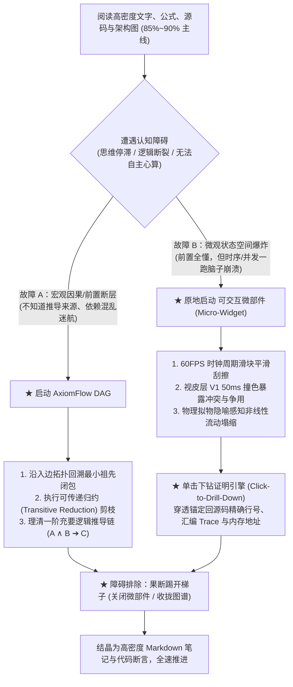

# AxiomFlow 认知工效学与故障分流操作指南 (Cognitive Ergonomics & Blocker Triage Protocol)

**版本**: v1.0  
**定位**: AxiomFlow 知识工程、媒介分工与人机交互操作宪章 (Core Operational Charter)  
**适用对象**: 研发工程师、科研学者及后续协同开发 AI Agent

---

## 1. 核心哲学与维特根斯坦梯子原则 (The Ladder Principle)

人类前额叶（PFC）的工作记忆容量在生理学上被严格限制在 $7 \pm 2$ 个组块（Chunks），串行符号解码带宽仅为数十 bps。而初级视皮层（V1）、背侧流与小脑感觉-运动闭环则具备数个数量级的超并行吞吐潜能。

然而，**吞吐潜能不等于认知效率**。认知工具的设计与使用必须严格遵循以下根本公理：

### 1.1 纯净符号的“第一媒介”地位 (Text & Formal Symbols as Primary Medium)
* **极值信息熵**：文字、C/C++ 源码与数学公式是人类文明迄今信息压缩比最高、严谨度最高的载体；
* **无障碍高速行军**：只要前额叶的内部模拟器能够顺畅完成逻辑推演与状态转移，**文字与源码永远是阻抗最低、速度最快的交互媒介**；
* **拒绝游戏化代糖**：盲目将所有概念动画化或交互化，会引入巨大的机械操作阻抗（鼠标位移、时间锁相动画、隐喻泄漏），将严肃的系统工程降维成儿童科普。

### 1.2 维特根斯坦梯子原则 (Wittgenstein's Ladder)
> “凡能够说的，都能够说清楚；凡不能谈的，就应该保持沉默。……我的命题可以这样作为阐释：谁理解我，谁最后就把它们看作是无意义的，当他凭借这些命题——越过这些命题——爬上去之后。（可以说，在爬上梯子之后，他必须把梯子扔掉。）” —— 路德维希·维特根斯坦《逻辑哲学论》

* **可探索微部件与 DAG 图谱本质上是“登顶的临时梯子”**；
* 它们的存在不是为了让人在梯子上流连忘返，而是为了在思维短路的关键时刻**提供临时的认知减阻**；
* 一旦前额叶借助感官通道建立了物理直觉并完成了形式化验证，**必须立刻踢开梯子，回归高密度文本与代码**。

---

## 2. 二维故障分流模型：DAG vs. 微部件 (Two-Dimensional Triage Model)

当学习者在阅读高密度文本、公式或源码遭遇阻抗时，**卡壳的原因绝非单一维度的“难”，而是两种正交维度的认知故障**：

---

### 2.1 故障类型 A：宏观因果断层 (Macro-Causal Gap) $\implies$ 呼叫 DAG
* **典型临床表征**：
  * “作者是怎么从定理 2.1 突然跳到结论 3.4 的？”
  * “面对虚拟内存，Cache、TLB、页表、CR3、Page Fault 概念交织，分不清谁是谁的前提。”
  * “陷入了局部代码细节，看不清达成系统目标的核心因果主线。”
* **故障本质**：缺少数学偏序关系（Partial Order）与拓扑关键路径。
* **DAG 处方**：
  1. 将碎片概念提取为独立的原子命题卡片；
  2. 建立严格的有向因果连线；
  3. **拓扑反向回溯与剪枝**：直接提取目标节点的最小祖先子图（Minimal Ancestral Subgraph），剔除 80% 无关知识，看清充要推导骨架。

---

### 2.2 故障类型 B：微观状态爆炸 (Micro-State Explosion) $\implies$ 呼叫 可交互微部件
* **典型临床表征**：
  * 宏观因果清清楚楚，前置定义倒背如流（例如：清楚五级流水线的每一个阶段，也知道发生数据冒险时需要 Forwarding 或 Stall）；
  * **但是，当 5 条指令在时间轴上并发交错，同时伴随 1 个分支预测错误与 2 个写后读（RAW）冲突时，人脑前额叶心算模拟器直接“爆显存（Stack Overflow）”**；
  * 或者是 Cache 伪共享：两个线程各自写独立变量，脑内无法凭空具象化底层 64 字节总线上的 MESI 状态风暴。
* **故障本质**：前额叶串行符号处理带宽被多变量非线性时空并发彻底冲垮。
* **微部件处方**：
  1. 在当前节点内原地激活微部件（拒绝表单和静态表格）；
  2. **60FPS 连续时序擦洗**：拖拽时间轴滑块，激活小脑感觉-运动回路，直观感知气泡撕裂与流水线粉碎；
  3. **初级视皮层 V1 撞色**：荧光红瞬间暴露内存颠簸与流动性真空；
  4. **单击穿透下钻**：直觉打通后，单击异常色块，瞬间下钻高亮对应的 C 源码行与十六进制物理内存地址。

---

## 3. 实战心法表 (The Operational Cheat-Sheet)

在日常高强度科研与底层系统工程研发中，遵循以下标准作战工序：

| 推进阶段 | 战术目标 | 主战媒介 | 纪律与红线 |
| :--- | :--- | :--- | :--- |
| **阶段 1：平原行军 (85%~90%)** | 概念吞吐、API 学习、单向算法逻辑、架构通读 | **纯文本 + 源码 + 静态公式 + 架构图** | • 速度优先，不做花哨动画； • 只记录不变量、边界条件与源码关键行； • **严禁提前早熟画图或写微部件**。 |
| **阶段 2：因果迷航 (5%~7%)** | 理不清前置充要依赖、论证跨度巨大、概念网络缠绕 | **AxiomFlow DAG (有向无环图)** | • 严格保证节点原子性与边的因果纯度； • 执行可传递归约，剪除冗余连线； • 理清充要因果链后立刻收拢视窗。 |
| **阶段 3：状态爆炸 (5%~7%)** | 多变量并发竞态、微架构时钟冲突、非线性相变曲面 | **局部可交互微部件 (Micro-Widget)** | • 限制在 1~3 分钟内建立感官物理直觉； • **必须完成单击下钻**，将直觉锚定回真实 C 源码； • **严禁流连忘返**，验证完毕立即关闭。 |
| **阶段 4：登顶结晶** | 知识资产沉淀、抗遗忘骨架建立 | **声明式 Markdown + C 代码断言** | • 踢开梯子（关闭微部件，导出/折叠局部图）； • 仅将验证后的真理结晶记录于笔记库； • 回到阶段 1 继续全速行军。 |

---

## 4. 消灭三大伪图反模式 (Anti-Patterns)

DAG 的高密度建立在严格的图论纪律之上。后续工程演进与日常使用严禁触犯以下反模式：

### 4.1 画框狂热反模式 (Canvas Inflation Trap)
* **表现**：把原本三行代码或一个清晰的 Markdown 列表能陈述的事实，强行拆成 5 张只有一两句话的小卡片，满画布都是阴影、边框与交织连线。
* **铁律**：**脱离了上下文无法自成一个独立的“公理 / 结构体 / 状态机 / 形式化证明闭环”的内容，严禁独立成卡。**

### 4.2 弱语义关联线反模式 (Semantic Dilution Trap)
* **表现**：把有向箭头当成“我觉得这两者有点关系”的联想线，导致图谱迅速退化为无序的“思维导图毛线球”。
* **铁律**：**AxiomFlow 的有向边有且仅有两种定义：① 充要推导因果；② 反应式参数总线（输入输出契约）。严禁建立任何模糊的参考连线。**

### 4.3 巨石大长文反模式 (Monolithic Card Trap)
* **表现**：在一张卡片内塞入 5000 字长文，外部再连几条毫无约束的边。
* **铁律**：长篇大论请留给本地 Markdown 编辑器；画布上的卡片必须是高度精炼、具备下钻探针的因果原子。

---

## 5. 对后续协同开发 Agent 的技术断言 (Engineering Charter)

后续接手 AxiomFlow 开发的任何 AI 智能体，必须以此文档为交互设计的唯一真实源（SSOT）：
1. **不得为不存在“状态空间爆炸”的领域盲目新增微部件**；
2. **所有新建的微部件必须内置“单击下钻”到源码与地址的事件发射机制**；
3. **DAG 引擎必须优先保障拓扑剪枝（Ego-Graph、可传递归约）与因果门控，严禁退化为普通白板绘画工具**。
