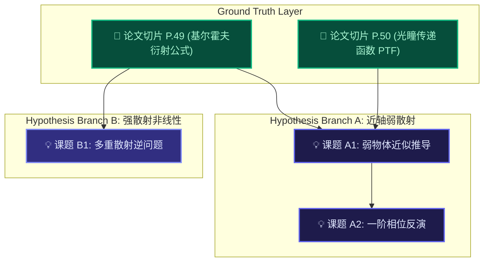

# ADR-01: 核心拓扑隔离与抗幻觉真理架构 (Topological Isolation & Ground Truth Architecture)

**日期**: 2026-09-03  
**状态**: ✅ Accepted (已通过核心架构决议)  
**核心原则**: 客观公理锚定优先 (Ground Truth First) 与 拓扑因果物理隔离 (Physical Topological Isolation)

---

## 1. 背景与行业痛点 (Context & Problem Statement)

大语言模型（LLM）在通用自然语言处理与代码辅助生成方面取得了突破性进展，但在深度自然科学（如光学成像、量子力学、凝聚态物理、数理推导）场景下，传统的线性对话界面（Linear Chatbot / ChatPDF）暴露出了毁灭性的工程与学术缺陷：

1. **“迷失在中间”与注意力衰减 (Lost in the Middle Syndrome)**：
   长对话（30+ 轮）使得上下文窗口迅速膨胀。随着上下文长度增加，大模型对窗口中部关键事实（如特定的弱散射近似物理边界条件、微米级数值孔径）的召回率呈指数级下跌，从而导致幻觉（Hallucination）滋生。
2. **多假设交叉污染 (Hypothesis Contamination & Context Bleeding)**：
   在真实的科研探索中，研究者通常需要针对同一个前置条件展开多个分支假设的推演（例如：分支 A 假设“近轴傍轴近似”，分支 B 假设“广角非线性逆散射”）。在传统的单线程线性对话中，所有分支的历史回答被强行拼装在同一个连续 Prompt 中，大模型必然产生前后矛盾、概念偷换与逻辑死锁。
3. **二维数学公式的信息降维扁平化 (2D Mathematical Flattening)**：
   传统的文本划词与 OCR 仅能复制出断裂的字符流，将具有复杂拓扑结构的二维数学式（积分上下限、分式嵌套、矩阵张量、光路符号）压缩为破碎文本，直接破坏了数学模型的自洽性。

---

## 2. 架构决策 (Architecture Decision)

为了彻底解决上述痛点，AxiomFlow 抛弃了传统的“平铺式长对话”模式，确立了以**有向无环图（DAG）拓扑因果隔离**为核心的工程架构：

### 决策一：实体分型与单向因果流向
系统内所有知识单元严格划分为两类核心实体：
* **客观实证节点 (`material`)**：
  * **定义**：不可篡改的论文客观事实、原版切片图像或实验台账数据；
  * **元数据约束**：必须强行绑定文献名称与精准物理页码（如 `《差分相衬显微成像...》 (P.50)`）或高清原版像素切片；
  * **只读性**：大模型不得擅自修改实证正文，其仅作为纯净先验输入。
* **探索课题节点 (`question`)**：
  * **定义**：人类研究者的学术假设、推导目标或追问指令；
  * **生成行为**：大模型推演输出严格受限于连入的有效上游证据，禁止在无事实依据下凭空推导。

### 决策二：物理级拓扑因果隔离与动态 Prompt 编译
* **祖先追溯算法 (Topological Ancestor Traversal)**：
  当针对课题节点 $N_k$ 请求大模型生成时，编译引擎在 DAG 图中仅逆向深度遍历其**直接连入的有向祖先节点链**：
  $$\text{Context}(N_k) = \bigcup_{p \in \text{Ancestors}(N_k)} \text{Payload}(p)$$
* **剪枝分支 100% 物理剥离**：
  任何未经连线挂载的兄弟分支、平行假设或已废弃节点，在发起 HTTP 请求时**被物理剔除**，根本不会进入大模型上下文，从而将上下文污染率在网络层降为绝对的 $0\%$。

### 决策三：多模态视觉切片与 LaTeX 闭环反编译
* 放弃纯字符划词，引入原版 Canvas 比例像素裁剪；
* 将高清视觉切片直传多模态视觉模型（Gemini Vision），在服务端逆向工程反编译为标准的 LaTeX 数学表达式与物理变量定义，再经由 KaTeX 实现保真矢量渲染。

---

## 3. 架构红线与不可违背原则 (Architecture Invariants)

任何后续接手 AxiomFlow 的人类开发者或 AI 协同智能体，**必须誓死捍卫以下三条架构红线**：

1. **【红线一】绝对禁止退化为平铺线性对话 (Anti-Linear-Chat Invariant)**：
   不得为了图一时方便，将全局所有节点的问答内容合并为一个不断追加的字符串传递给大模型；必须严格执行拓扑祖先动态编译。
2. **【红线二】事实出处不可剥离 (Immutable Citation Invariant)**：
   所有从 PDF 中提取的切片或摘录事实，其出处标签（Citation）必须在持久化存储中与节点 ID 强绑定，严禁出现无文献源头的孤立“伪实证”。
3. **【红线三】零重量开箱即用原则 (Zero-Build Minimalism)**：
   前端必须保持纯原生无打包（Vanilla JS + 原生 DOM + 本地离线 Vendor），后端使用 Python 原生标准库（`http.server`, `urllib`）。**严禁擅自引入庞大臃肿的 npm 构建流水线（如 Webpack、Vite、React 全家桶）**，确保任意用户单克隆仓库后，双击运行 `python server.py` 即可在 1 秒内启动工作。

---

## 4. 架构收益 (Consequences & Benefits)

* **幻觉发生率断崖式下跌**：由于大模型的注意力被强制约束在精准的 $100 \sim 300$ Tokens 论文证据内，模型杜绝了凭空捏造公式与常数的可能；
* **可复现性与学术严密性**：任何一项推演结论，都可以沿着有向边反向追溯至原版文献的特定页码与高清切片，具备发表级学术可信度；
* **无限分支自由度**：研究者可自由拉取多条对照分支，同时探索不同流派的数学解法，互不干扰。
